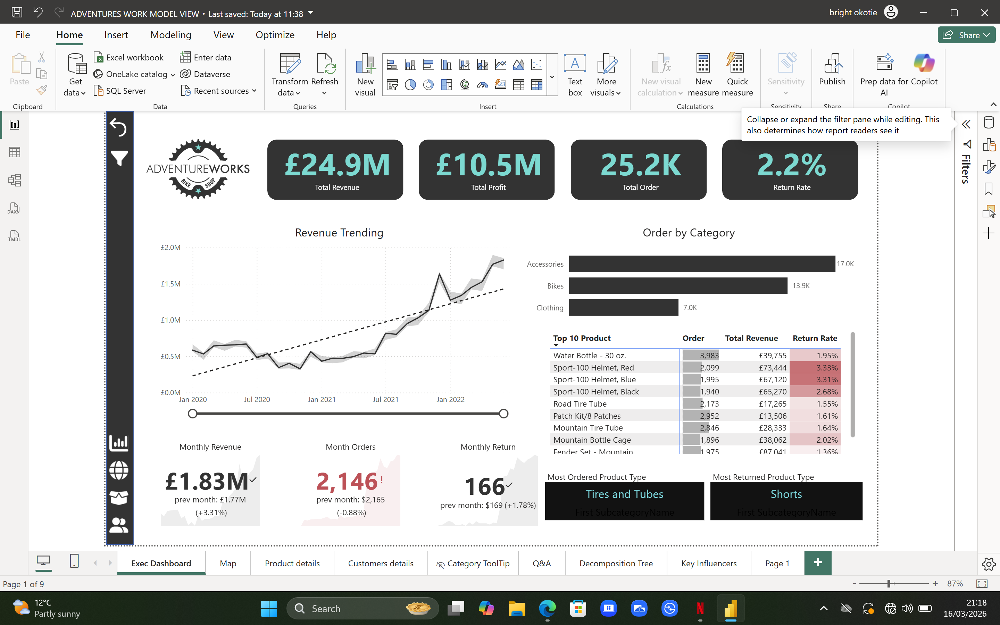

# powerbi-sales-dashboard

# 📊 AdventureWorks Sales Dashboard (Power BI)

## 📌 Project Overview
This project analyses retail sales data using Power BI to provide insights into revenue, profit, product performance and return rates.

---

## ❓ Business Questions
- How is revenue trending over time?
- Which products generate the most revenue?
- Which categories perform best?
- What is the return rate?

---

## 🛠 Tools Used
- Power BI
- SQL
- DAX
- Power Query
- Excel

---

## 📷 Dashboard Preview

---

## 📈 Key Insights
- Revenue shows steady growth over time
- Accessories generate the highest order volume
- Some high-selling products also have higher return rates

---

## 📁 Files
- `AdventureWorks.pbix` – Power BI dashboard file
- `dashboard_screenshot.png` – Dashboard preview
