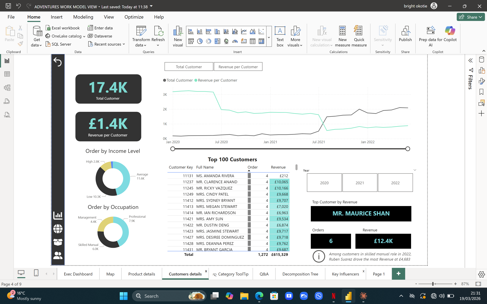
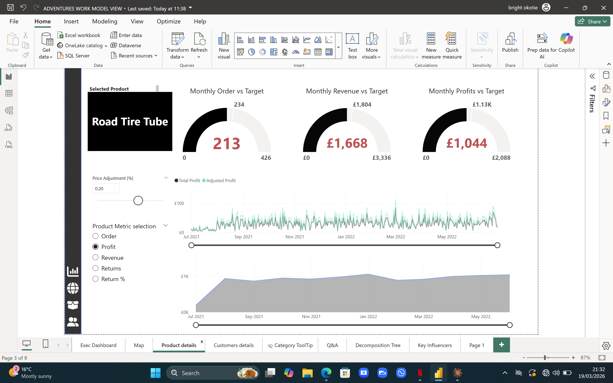

# powerbi-sales-dashboard

# 📊 AdventureWorks Sales Performance Dashboard

## 🧠 Project Summary
This project showcases an end-to-end Business Intelligence solution built in Power BI to analyse retail sales performance using the AdventureWorks dataset.

The dashboard was designed to support decision-making by providing clear, interactive insights into revenue trends, product performance, and operational efficiency.

---

## 🎯 Objectives
The main goal of this project was to:

- Monitor overall business performance through key KPIs
- Identify high-performing and underperforming products
- Analyse sales trends over time
- Evaluate return rates and potential operational issues
- Enable stakeholders to make data-driven decisions quickly

---

## ❓ Key Business Questions
This dashboard answers:

- How is revenue trending over time?
- Which product categories drive the most sales?
- What are the top-performing products?
- Which products have high return rates?
- Are there patterns in order volume over time?

---

## 🛠️ Tools & Technologies
- Power BI – Dashboard development & visualisation  
- DAX – Measures and calculations  
- Power Query – Data cleaning & transformation  
- SQL – Data extraction and preparation  
- Excel – Data validation and exploration  

---

## 🧱 Data Modelling & Transformation
Data was cleaned and transformed using Power Query before building a structured data model.

Key steps included:
- Data cleaning and handling missing values  
- Creating relationships between tables  
- Developing calculated columns and measures  
- Structuring data for efficient analysis  

## Example DAX Measures
``DAX
Total Revenue = SUM(Sales[SalesAmount])

Total Profit = SUM(Sales[Profit])

Return Rate = DIVIDE([Returned Orders], [Total Orders])
---

## 📷 Dashboard Preview

### Customer Insights

### Product Performance

---
## 📈 Revenue Trend Analysis
Visualises revenue over time
Identifies growth patterns and seasonality
Includes trendline for long-term direction
---

## 📈 Key Insights
- Revenue shows steady growth over time
- Accessories generate the highest order volume
- Some high-selling products also have higher return rates
- Monthly returns up slightly (+1.78%)

---
## 💡 Business Impact

This dashboard demonstrates how data can be used to:

Improve visibility of business performance
Support faster and more informed decision-making
Identify operational inefficiencies
Highlight opportunities for growth and optimisation
---
## 📁 Files
- `AdventureWorks.pbix` – Power BI dashboard file
- `dashboard_screenshot.png` – Dashboard preview
